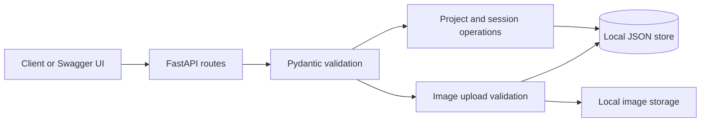

# Polyphony

Polyphony is an early backend foundation for an AI creative operating system.
Its long-term goal is to combine visual understanding, spatial editing, audio
intelligence, creative reasoning, and session memory in one guided production
environment.

The current milestone is deliberately small: it provides the project, session,
and image-asset backbone that future intelligence and editing layers can build
upon.

## Current Capabilities

- Create and list creative projects
- Create and list sessions within a project
- Retrieve project and session details
- Upload image assets to a session
- Validate image extension and maximum upload size
- Persist local metadata in a human-readable JSON store
- Generate stable IDs and timezone-aware timestamps
- Explore and test every endpoint through FastAPI Swagger documentation

## Current Architecture



The application currently has three layers:

1. **API layer** exposes health, project, session, and asset endpoints.
2. **Model layer** validates requests and defines stable response contracts.
3. **Storage layer** persists metadata and uploaded images on the local
   filesystem.

This foundation intentionally avoids introducing AI orchestration before the
core production entities and asset lifecycle are understandable and testable.

## Product Vision

Polyphony is designed to evolve beyond a conventional editor:

- **Understanding layer:** interpret images, video, audio, and creative intent
- **Spatial layer:** divide a scene into meaningful editable zones
- **Reasoning layer:** maintain style, narrative, and emotional coherence
- **Execution layer:** perform visual, audio, and timeline operations
- **Creative director:** recommend the next useful creative decision
- **Memory layer:** preserve preferences, revisions, and project history
- **Sentinel layer:** monitor pipeline health and support recovery or undo

Concept explorations are available in [`docs/architecture`](docs/architecture).
They describe the creative-producer and spatial creative-director directions;
they are design references, not features already implemented in the backend.

## Technology

| Area | Technology |
| --- | --- |
| API | FastAPI |
| Validation | Pydantic |
| Storage | JSON metadata and local filesystem |
| Language | Python 3.11+ |

## Project Structure

```text
polyphony/
|-- backend/
|   |-- app/
|   |   |-- config.py    # Paths, limits, and supported image types
|   |   |-- main.py      # API routes and local persistence
|   |   `-- models.py    # Request, response, and storage models
|   |-- assets/images/   # Ignored runtime uploads
|   |-- data/            # Ignored local JSON store
|   `-- requirements.txt
`-- docs/
    |-- architecture/    # Product and system design concepts
    `-- steps-and-plan.md
```

## Run Locally

```bash
cd backend
python3.11 -m venv .venv
source .venv/bin/activate
pip install -r requirements.txt
uvicorn app.main:app --reload
```

Open:

- API: `http://127.0.0.1:8000`
- Interactive documentation: `http://127.0.0.1:8000/docs`
- Health check: `http://127.0.0.1:8000/health`

No API key or environment file is required for the current milestone.

## API Endpoints

| Method | Endpoint | Purpose |
| --- | --- | --- |
| `GET` | `/health` | Check application status |
| `POST` | `/projects` | Create a creative project |
| `GET` | `/projects` | List projects |
| `GET` | `/projects/{project_id}` | Retrieve project details |
| `POST` | `/sessions` | Create a project session |
| `GET` | `/sessions` | List or filter sessions |
| `GET` | `/sessions/{session_id}` | Retrieve session details |
| `POST` | `/sessions/{session_id}/images` | Upload an image |
| `GET` | `/projects/{project_id}/assets` | List project assets |

## Example Workflow

Create a project:

```bash
curl -X POST http://127.0.0.1:8000/projects \
  -H "Content-Type: application/json" \
  -d '{
    "title": "Campaign Concept",
    "creative_goal": "Develop a coherent visual direction for a launch film"
  }'
```

Create a session using the returned project ID:

```bash
curl -X POST http://127.0.0.1:8000/sessions \
  -H "Content-Type: application/json" \
  -d '{
    "project_id": "project_REPLACE_ME",
    "title": "Visual exploration"
  }'
```

Upload an image using the returned session ID:

```bash
curl -X POST http://127.0.0.1:8000/sessions/session_REPLACE_ME/images \
  -F "file=@reference-image.png"
```

## Storage and Privacy

The current local store is intended for development only. Generated JSON,
uploaded images, virtual environments, secrets, and operating-system files are
excluded from version control. No user assets or production data belong in the
repository.

Before supporting real users, Polyphony will need authentication, database
persistence, concurrent-safe writes, media content inspection, object storage,
authorization, retention controls, and private asset delivery.

## Roadmap

1. Replace JSON storage with a transactional database.
2. Add project update, session archive, and asset deletion operations.
3. Build the visual workspace and upload interface.
4. Introduce image understanding and editable-region detection.
5. Add grounded creative suggestions and decision memory.
6. Connect visual execution tools with reversible edit history.
7. Extend sessions to video, music analysis, and timeline orchestration.
