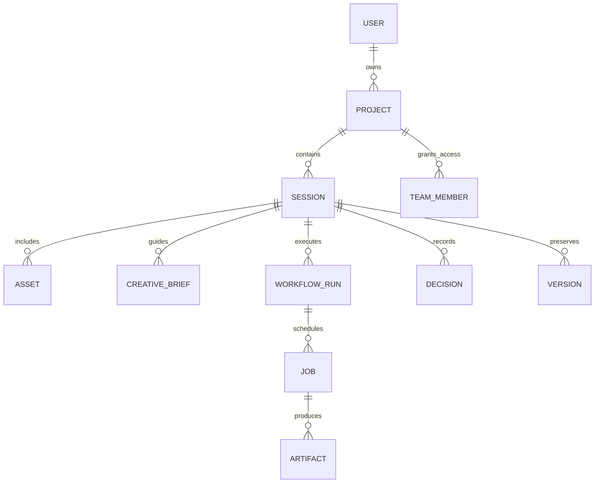
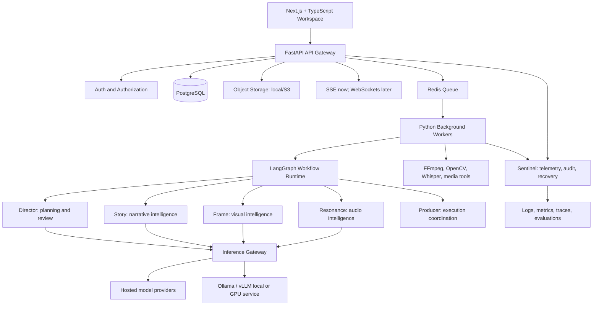
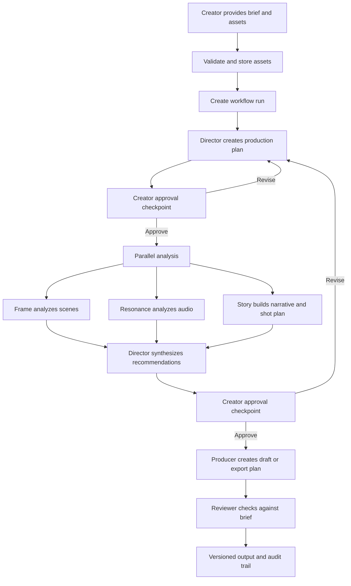
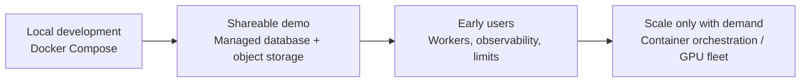

# Polyphony Startup Blueprint

**Status:** Living product and technical design document
**Last updated:** 2026-08-21
**Purpose:** Guide Polyphony from a learning project to a credible startup-ready
AI creative-production platform.

## 1. Executive Summary

Polyphony is an **AI Creative Operating System**: a multimodal collaborator
that helps a creator turn an idea into a finished production. It is not only a
video editor, image generator, or chatbot. Its differentiator is the reasoning
layer above creative tools: it understands a brief, plans the work, analyzes
assets, recommends decisions, coordinates execution, critiques outputs, and
remembers decisions across revisions.

The first target user is an individual creator making short-form video or a
small campaign. The initial product should help them turn a creative brief and
uploaded assets into a structured production plan, with transparent,
human-approved recommendations. Automation increases gradually; user control
is never removed.

Polyphony has two deliberate outcomes:

1. Build a real product with a focused, differentiated first workflow.
2. Build evidence of strong engineering across backend, AI systems,
infrastructure, frontend, cloud, and systems programming.

## 2. Product Definition

### Vision

Reduce the gap between an idea and professional-quality creative output.

### Product statement

Polyphony is an AI creative-production partner that understands, plans,
produces, critiques, and improves multimodal creative work.

### What it is not

- Not a generic chat interface around a model.
- Not an attempt to replace Adobe, Runway, or Canva feature for feature.
- Not an autonomous system that edits or publishes without creator approval.
- Not a collection of disconnected AI tools.

### Product wedge: the first workflow

Start with **short-form launch videos** for individual creators and small
teams. A creator provides a brief and rough footage or images. Polyphony:

1. Turns the brief into an editable creative plan.
2. Analyzes supplied assets against that plan.
3. Proposes a story structure, shot order, pacing, captions, and music
   direction.
4. Explains why each recommendation supports the stated audience and emotion.
5. Produces an export plan or draft only after explicit approval.

This is narrow enough to build and test, while naturally expanding to other
creative formats later.

### Target users

| Phase | User | Primary need |
| --- | --- | --- |
| 1 | Students, solo filmmakers, YouTubers | Clear creative guidance and a faster planning workflow |
| 2 | Editors, agencies, marketing teams | Shared production context, reviews, and repeatable workflows |
| 3 | Studios and enterprise media teams | Governance, collaboration, brand consistency, and scale |

## 3. Current Reality: What Is Already Built

Polyphony is at **Foundation milestone 1**, not yet at the AI workflow stage.
That is a good start: production entities and assets must exist before agents
can operate reliably.

### Implemented

- FastAPI application with Swagger documentation.
- Health endpoint.
- Create, list, and retrieve creative projects.
- Create, list, and retrieve sessions belonging to a project.
- Upload images to a session.
- Image extension and 10 MB size validation.
- Stable generated IDs and UTC timestamps.
- Local JSON metadata store and local image storage.

### Deliberately not implemented

- User accounts, authentication, teams, or authorization.
- PostgreSQL, migrations, or concurrent-safe persistence.
- Frontend workspace.
- Video, audio, document, or large-media support.
- Background jobs, queues, event streaming, or notifications.
- LangGraph, agents, model providers, or AI analysis.
- Editing and export tools.
- Object storage, production deployment, monitoring, and evaluation.

### Evidence in the repository

- The current routes and local persistence live in
  [`backend/app/main.py`](../backend/app/main.py).
- The current data contracts are in
  [`backend/app/models.py`](../backend/app/models.py).
- The app currently stores data in local JSON and image folders, configured in
  [`backend/app/config.py`](../backend/app/config.py).

## 4. Product Principles

1. **Intent before execution.** Understand the audience, format, emotion, and
   creative goal before recommending an edit.
2. **Human approval at decision points.** Agents propose; creators choose.
3. **Explainable creative reasoning.** Recommendations include their evidence
   and connection to the brief.
4. **Reversible production.** Every generated plan, edit, and export has a
   version and can be rolled back.
5. **Asset-first architecture.** AI workflows operate on well-modeled assets,
   jobs, and versioned outputs, not temporary chat history.
6. **Provider independence.** Business logic never depends directly on one AI
   vendor or one model.
7. **Learn in slices.** Each milestone ships a small usable outcome and teaches
   a concrete engineering concept.
8. **Cloud-ready, not cloud-dependent.** Develop locally; adopt managed cloud
   services only when they solve a real need.

## 5. Core Domain Model

| Entity | Why it exists |
| --- | --- |
| User and TeamMember | Identity, ownership, collaboration, authorization |
| Project | A long-lived creative initiative, such as a campaign |
| Session | One focused production or revision effort inside a project |
| Asset | An uploaded or generated image, video, audio, document, or export |
| CreativeBrief | Audience, channel, duration, tone, constraints, and success criteria |
| WorkflowRun | A versioned execution of an agent workflow |
| Job | An asynchronous, observable unit of work |
| Artifact | Structured output such as a transcript, storyboard, analysis, or edit plan |
| Decision | A human or agent recommendation, approval, rejection, and rationale |
| Version | A recoverable snapshot of plans, edits, and exports |

## 6. Target System Architecture

### Architecture layers

| Layer | Responsibility | Initial technology |
| --- | --- | --- |
| Product experience | Workspace, timeline, review, progress | Next.js, React, TypeScript, Tailwind |
| API and domain | Auth, projects, sessions, assets, decisions | FastAPI, Pydantic, SQLAlchemy or SQLModel |
| Workflow | Durable state, branching, retries, approvals | LangGraph |
| Async execution | Long-running media and model tasks | Redis plus a Python worker framework |
| Intelligence | Planning, vision, audio, retrieval, model routing | Python, selected models, provider adapters |
| Media execution | Transcode, extract, analyze, render | FFmpeg, OpenCV; C++ only for proven bottlenecks |
| Data | Relational state, cache, assets, search | PostgreSQL, Redis, local storage then S3 |
| Operations | Reliability, auditability, cost, evaluation | OpenTelemetry-compatible logs/metrics/traces |

## 7. Agent and Workflow Design

LangGraph is the correct workflow tool because Polyphony requires stateful,
branching, reviewable processes with retries and human-in-the-loop pauses.
LangChain can be used only as an optional utility dependency; it must not be
the primary application architecture.

### Agent responsibilities

| Component | Responsibility | Must not do |
| --- | --- | --- |
| Director | Interpret brief, choose workflow, maintain creative consistency, request review | Directly own low-level media processing |
| Story | Script, narrative arc, shot list, captions, marketing copy | Decide infrastructure routing |
| Frame | Scene understanding, composition, segmentation, visual suggestions | Change final output without approval |
| Resonance | Speech, beat, mood, music alignment, audio suggestions | Invent narrative intent without the brief |
| Producer | Schedule tools and jobs, collect artifacts, coordinate dependencies | Make creative judgments |
| Reviewer | Check output against the brief and quality rubric | Bypass creator approval |
| Sentinel | Telemetry, audit trail, recovery signals, version history | Act as a product-facing creative agent |

### First production workflow

Every node must emit structured artifacts, status, timing, model metadata, and
an error reason where applicable. Free-form chat text alone is not a durable
workflow contract.

## 8. Inference Gateway

The application and agents call one internal interface. They do not call
OpenAI, Anthropic, Gemini, Ollama, or vLLM directly.

### Responsibilities

- Select an approved provider and model for the task.
- Apply timeout, retry, rate-limit, and cost guardrails.
- Normalize streaming and non-streaming responses.
- Log model, latency, tokens or compute units, cost estimate, and failure.
- Cache safe, deterministic analysis by asset hash and model version.
- Support local models for learning and privacy-sensitive development.

### Routing policy, initial version

| Job type | Default routing approach |
| --- | --- |
| Brief and long-form creative reasoning | Strong hosted reasoning model, configurable |
| Captions and structured extraction | Cost-effective text model or local model |
| Speech transcription | Whisper or equivalent local/hosted service |
| Image scene understanding | Vision-capable provider or open model |
| Video analysis | FFmpeg frame extraction followed by sampled vision jobs |
| Experimental local inference | Ollama locally; vLLM only after one model needs serving at scale |

Model selection is a configuration and evaluation problem, not hardcoded agent
logic. Store prompts carefully: redact secrets and minimize retention of
customer content.

## 9. Data, Storage, and Security

### Data evolution

| Stage | Relational data | Asset data | Cache / queue |
| --- | --- | --- | --- |
| Current | Local JSON | Local disk | None |
| Local MVP | PostgreSQL in Docker | Local disk or MinIO | Redis in Docker |
| Cloud demo | Managed PostgreSQL | S3 | Managed or self-hosted Redis |
| Startup scale | PostgreSQL with backups/read strategy | S3 plus CDN | Managed Redis and worker autoscaling |

### Security baseline before public users

- Add authenticated users, project roles, and server-side authorization.
- Use signed upload/download URLs rather than exposing filesystem paths.
- Validate media type by content inspection, not filename alone.
- Enforce upload limits, quotas, and virus or malware scanning policy.
- Store secrets in environment variables locally and a managed secret store in
  cloud environments; never commit them.
- Encrypt transport, restrict object access, and establish deletion/retention
  behavior before inviting external users.
- Keep an audit record for uploads, workflow runs, approvals, exports, and
  team access changes.

## 10. Delivery Roadmap

The roadmap intentionally builds the product in vertical slices. A milestone
is complete only when it has a demo path, tests for the key behavior, and a
short architecture note explaining the decisions.

### Milestone 0: Foundation (complete)

**Outcome:** Local API can create projects and sessions and accept image
assets.

**Completed:** FastAPI, Pydantic contracts, project/session CRUD subset, image
upload, local JSON storage, basic validation, Swagger.

**Known constraints:** No tests visible yet; JSON is not safe for concurrent
writes; no auth; uploaded files live on local disk.

### Milestone 1: Durable local product core

**Outcome:** A creator can sign in and manage project data safely on a local
Docker stack.

- Introduce Docker Compose for API, PostgreSQL, and Redis.
- Replace JSON storage with PostgreSQL and migrations.
- Add user identity, JWT/session auth, project ownership, and basic roles.
- Add project/session updates and archive behavior.
- Add an asset table with content hash and storage abstraction.
- Add pytest coverage for core API paths.
- Publish a simple OpenAPI-backed API contract.

**Portfolio skills:** relational modeling, migrations, auth, containers,
testing, API design.

### Milestone 2: Creator workspace and async media ingestion

**Outcome:** A creator has a visual workspace and can upload an asset without
waiting for processing.

- Build Next.js + TypeScript frontend with project, session, and upload views.
- Add video/audio upload validation and metadata extraction.
- Return `202 Accepted` for expensive work; create a persisted job record.
- Add Redis-backed worker process and job-state endpoints.
- Extract video metadata and preview frames using FFmpeg.
- Stream job progress with Server-Sent Events.

**Portfolio skills:** React product work, async systems, queues, media
pipelines, progress streaming.

### Milestone 3: Brief-to-plan intelligence MVP

**Outcome:** A creator enters a creative brief and receives an editable,
versioned production plan.

- Define CreativeBrief, Decision, Artifact, WorkflowRun, and Version models.
- Build the Inference Gateway with one hosted provider and one local adapter.
- Add LangGraph Director and Story workflow only.
- Produce structured brief critique, audience profile, narrative arc, and shot
  list.
- Add creator review/approve/revise checkpoints.
- Log model, prompt template version, latency, and estimated cost.
- Add a small evaluation set of representative briefs and quality rubric.

**Portfolio skills:** agentic workflows, provider abstraction, structured
outputs, human-in-the-loop design, evaluations.

### Milestone 4: Asset understanding

**Outcome:** Polyphony compares real uploaded assets to the approved plan.

- Add Frame: scene detection, sampled-frame analysis, composition notes, and
  asset-to-shot matching.
- Add Resonance: transcription, beat/BPM or mood metadata, and timing cues.
- Cache analyses by content hash plus model/version.
- Display evidence and confidence alongside each recommendation.
- Add retry, cancellation, partial-failure, and idempotency behavior.

**Portfolio skills:** multimodal pipelines, caching, resilient workers,
observability, AI quality measurement.

### Milestone 5: Reviewable draft assembly

**Outcome:** Polyphony produces a non-destructive draft or a precise edit plan
for a short-form video.

- Producer coordinates FFmpeg operations through explicit job contracts.
- Generate captions, segment timing, shot order, and an edit decision list.
- Store all generated outputs as versioned artifacts.
- Add Reviewer rubric: brief alignment, pacing, continuity, and missing-asset
  checks.
- Require final creator approval before export.

**Portfolio skills:** production workflows, versioning, media systems,
quality-control design.

### Milestone 6: Startup-ready demo deployment

**Outcome:** A secure, observable demo can be shared with a small group.

- Containerize API, workers, and frontend.
- Deploy frontend and API with separate environments.
- Use PostgreSQL backups, S3 object storage, and secure environment secrets.
- Add structured logs, metrics, traces, error alerts, and cost dashboards.
- Add rate limits, quotas, and a privacy/deletion policy.
- Create a demo dataset, onboarding flow, and feedback capture.

**Portfolio skills:** deployment, cloud architecture, operations, security,
product analytics.

### Milestone 7: Scale and infrastructure experiments

**Outcome:** Evidence-driven infrastructure learning without premature
complexity.

- Run an open model locally with Ollama and measure quality, latency, and cost.
- Serve one selected model with vLLM on a rented GPU only when useful.
- Add request batching, concurrency limits, queue priority, and load tests.
- Add evaluation regression gates before changing a model or prompt.
- Consider C++ with pybind11 only after profiling identifies a repeated media
  bottleneck that Python/FFmpeg cannot meet.
- Add worker scaling policy before considering Kubernetes.

**Do not start with:** microservices, Kubernetes, custom CUDA, self-hosted
model serving, or a C++ rewrite. Each is valuable only after the product and
measurements justify it.

## 11. Technology Decisions

| Area | Decision | Rationale |
| --- | --- | --- |
| Frontend | Next.js, React, TypeScript | Strong interactive product stack and hiring signal |
| Backend | Python, FastAPI | Best fit for AI/media ecosystem and clear APIs |
| Primary database | PostgreSQL | Relational project, workflow, user, and version data |
| Cache and queue | Redis | Familiar local-first queue/cache foundation |
| Workflows | LangGraph | Durable, stateful branching and human review steps |
| Media tools | FFmpeg and OpenCV | Mature, practical media processing |
| Model access | Internal Inference Gateway | Avoid provider lock-in and enable evaluation/routing |
| Local inference | Ollama first | Low setup cost for learning and experimentation |
| High-throughput serving | vLLM later | Introduce only when GPU serving is a real requirement |
| Performance code | C++ via pybind11 later | Learn systems work around measured hotspots |
| Infrastructure | Docker first; AWS later | Keeps development affordable and portable |

## 12. Local-to-Cloud Plan

### Local development

- Docker Compose: FastAPI, PostgreSQL, Redis, worker, optional MinIO.
- Host frontend locally with Next.js.
- Run open models only when the laptop can support them.
- Use a hosted model API only for the workflow being developed.

### Cloud demo target

- Container registry for API and worker images.
- Managed PostgreSQL for relational data.
- S3 for assets and generated outputs.
- CloudFront or equivalent CDN for private, signed delivery when needed.
- ECS/Fargate or a simple VM-based container deployment before EKS.
- Rented GPU provider for experiments; shut it down when not in use.

Cloud and GPU pricing change frequently. Set a monthly budget alert and verify
current provider prices immediately before provisioning; do not treat old
estimates as commitments.

## 13. Observability and Evaluation

Sentinel is a cross-cutting system, not a future afterthought. Every API
request, job, model call, and workflow node needs a correlation ID.

### Capture from the beginning

- Request and workflow run IDs.
- Job state, retries, duration, and error category.
- Model/provider, model version, prompt-template version, latency, and cost
  estimate.
- Asset hash, processor version, cache hit/miss, and processing duration.
- Creator approval/rejection and revision reason.
- Export success/failure and media-processing metrics.

### Evaluation loop

1. Maintain a small private set of representative briefs and sample assets.
2. Define a rubric for plan quality, factual asset grounding, creative
   alignment, and safety.
3. Run the set before changing prompts, models, or workflow behavior.
4. Store scores and reviewer notes; reject regressions unless intentionally
   accepted and documented.

## 14. Non-Functional Requirements

| Concern | Initial standard |
| --- | --- |
| Reliability | Jobs are retryable and idempotent; failures are visible to the creator |
| Performance | API remains responsive; heavy work is asynchronous |
| Privacy | Assets are private by default and deletable by owner |
| Cost | Every model and GPU task has a budgetable usage record |
| Explainability | Recommendations link to brief requirements and analyzed evidence |
| Accessibility | Core workspace is keyboard-usable and has clear status/progress text |
| Maintainability | Typed contracts, migrations, tests, and architecture notes ship with features |

## 15. Success Metrics

Do not optimize only for model demonstrations. Measure creator value.

| Stage | Signal |
| --- | --- |
| MVP | A creator completes brief-to-plan in one sitting without manual setup help |
| Asset understanding | Recommendations are grounded in uploaded assets and accepted or edited by the creator |
| Draft assembly | Time from brief to reviewable draft is meaningfully lower than the creator's baseline |
| Reliability | Most jobs complete without manual recovery; failure reasons are understandable |
| Cost | Cost per completed workflow is known and remains inside a defined budget |
| Startup validation | Early users return with another project and can explain the product value in their own words |

## 16. Risks and Guardrails

| Risk | Guardrail |
| --- | --- |
| Scope becomes an entire Adobe replacement | Protect the short-form brief-to-plan wedge until users validate it |
| Agents feel impressive but create no value | Track user approvals, edits, completion, and time saved |
| Cloud/GPU costs grow unexpectedly | Usage caps, shutdown policy, cost telemetry, budget alerts |
| Model-provider lock-in | Inference Gateway and stored provider-neutral artifacts |
| Hallucinated creative claims | Ground recommendations in brief and asset evidence; show uncertainty |
| Long jobs fail invisibly | Persisted jobs, retries, progress, cancellation, and error states |
| Premature infrastructure complexity | Introduce services only when measurements or user demand require them |
| Unclear ownership of media | Private-by-default permissions, deletion controls, and audit records |

## 17. Immediate Next Steps

1. Keep the existing foundation stable and add automated API tests.
2. Create a Docker Compose development environment with PostgreSQL and Redis.
3. Replace JSON persistence with database models and migrations before adding
   AI features.
4. Add authentication and project ownership before sharing the app.
5. Build the smallest frontend workspace for projects, sessions, and uploads.
6. Add jobs and background processing before supporting video or audio.
7. Build the first useful intelligence feature: **creative brief to editable
   production plan**, using Director + Story and the Inference Gateway.

## 18. Working Agreement

Polyphony will be built incrementally. Before each milestone, define the user
outcome, data model, API contract, acceptance checks, and one learning goal.
After each milestone, demo it locally, test the critical flow, document what
changed, and decide whether user evidence supports the next step.

This document is the source of truth for direction. It should change when we
learn something, but current implementation and future ideas must always be
labeled separately so the product remains honest, understandable, and
buildable.
